# FlareTower

[](https://github.com/iumalabs/flaretower/actions/workflows/ci.yml)
[](https://github.com/iumalabs/flaretower/actions/workflows/e2e.yml)
[](LICENSE)
[](https://github.com/iumalabs/flaretower/issues)
[](https://github.com/iumalabs/flaretower/commits/main)

Open-source control panel for Cloudflare — manage Workers, Access, DNS and security settings from
one place.

FlareTower is a self-hosted cockpit that runs as a single Cloudflare Worker. It is never publicly
accessible — see [Authentication](#authentication) before deploying.

Read [`.specify/memory/constitution.md`](.specify/memory/constitution.md) first; it is the
authoritative source for the project's principles, architecture, and security requirements. This
README covers day-to-day setup and operation only.

## Screenshots

All screenshots below use fictional sample data (the same "Acme Corp" theme the public landing
page's own sample panel uses) — not a real Cloudflare account.

|                                               |                                                   |
| --------------------------------------------- | ------------------------------------------------- |
| **Public landing page** — no sign-in required | **Overview** — the authenticated dashboard's home |
| 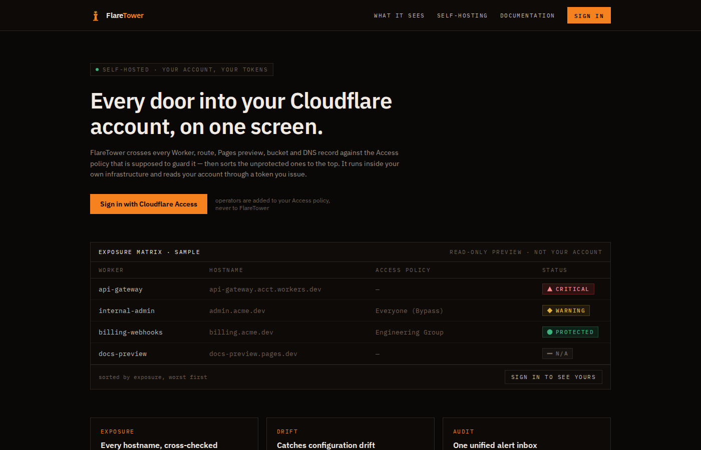 | 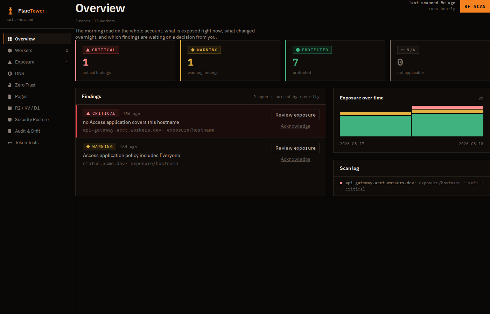        |

<details>
<summary>Screenshots of every module</summary>

|                                                    |                                                          |
| -------------------------------------------------- | -------------------------------------------------------- |
| **Workers**                                        | **Exposure matrix**                                      |
| 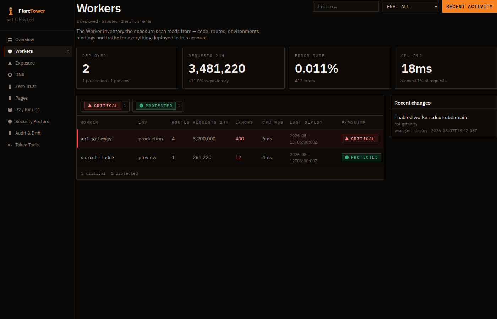           | 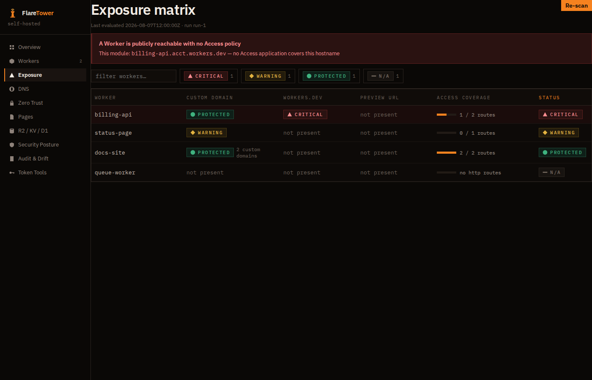        |
| **DNS records**                                    | **Zero Trust inventory**                                 |
| 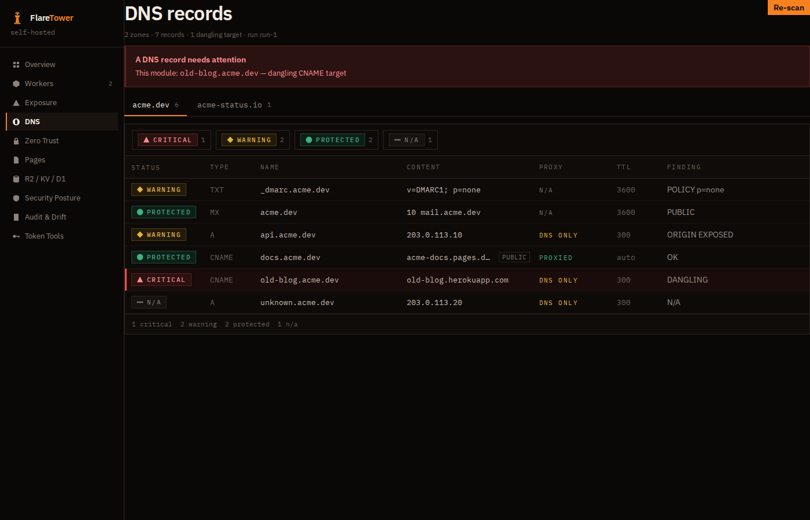           | 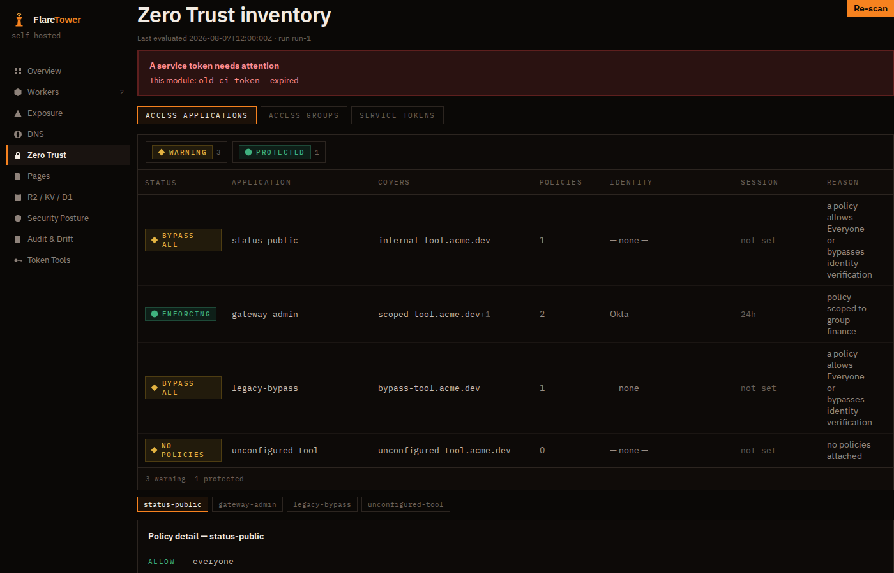 |
| **Pages projects**                                 | **R2 / KV / D1 storage**                                 |
| 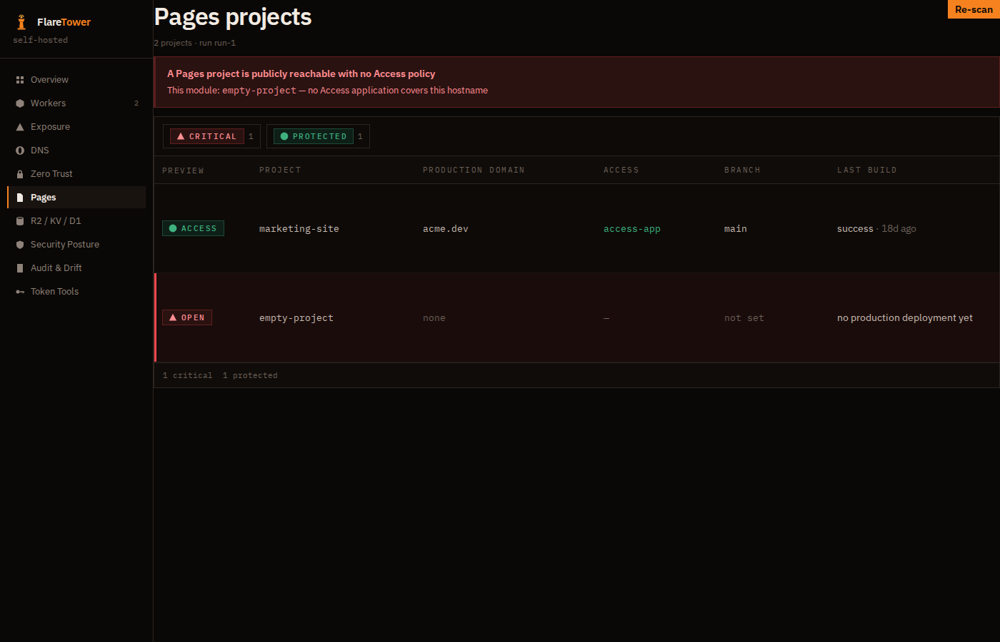      | 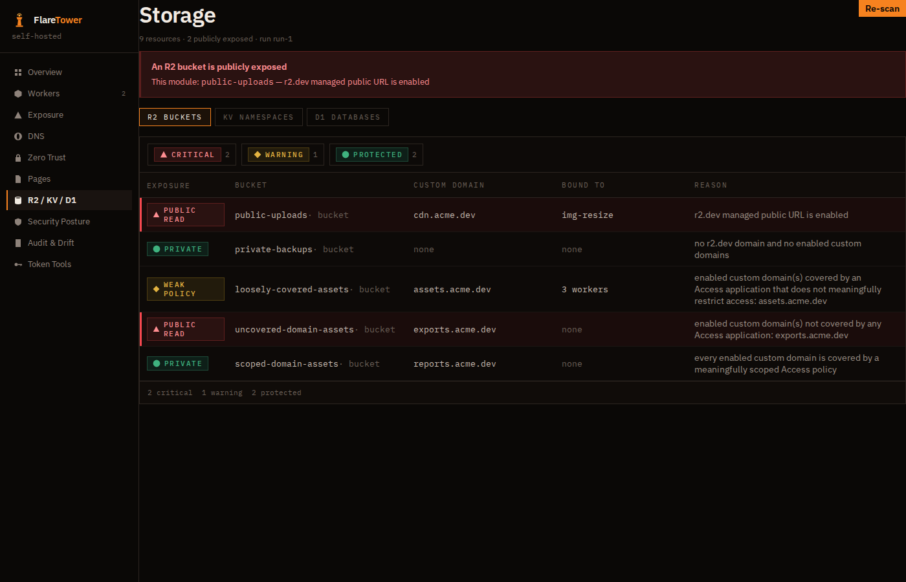                 |
| **Security posture**                               | **Audit & Drift**                                        |
| 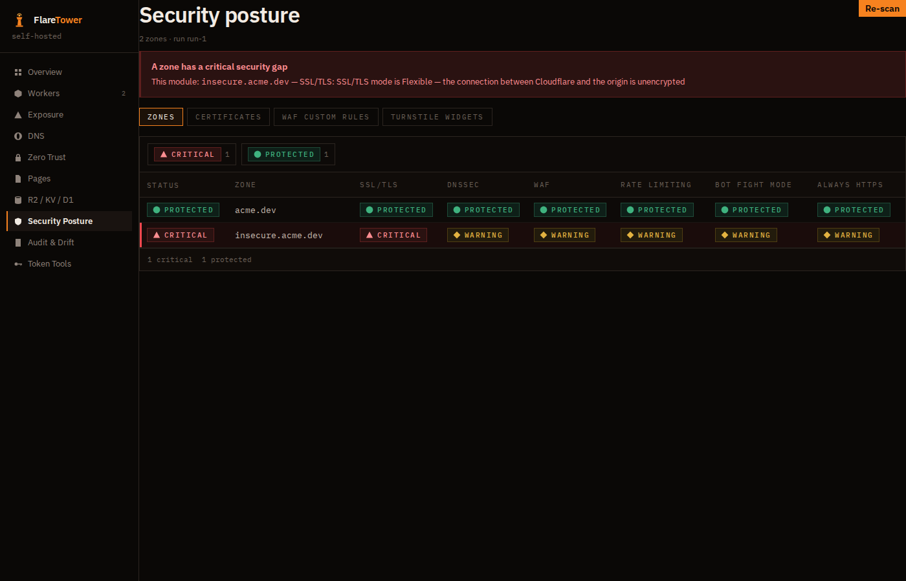 | 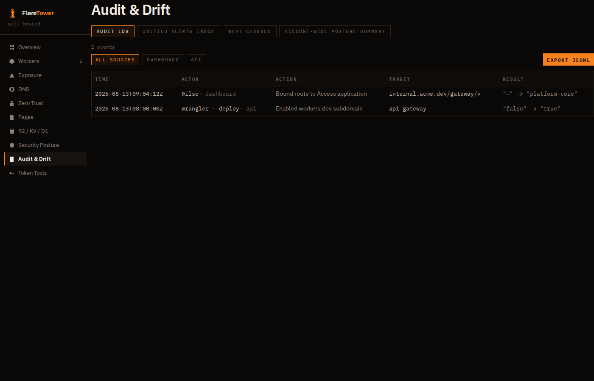             |
| **Token Tools**                                    |                                                          |
| 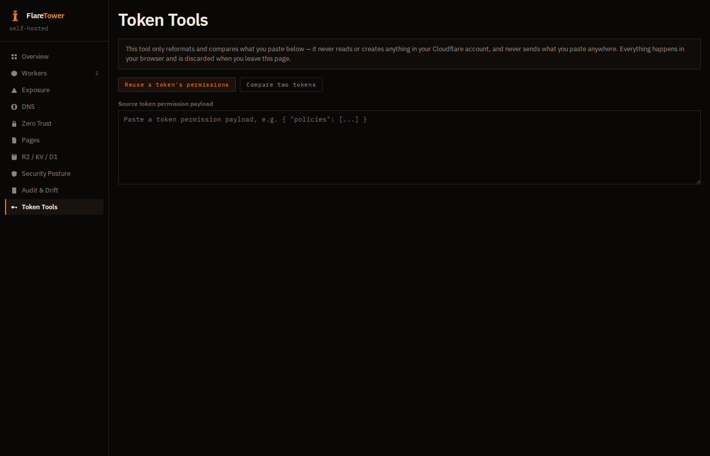   |                                                          |

</details>

## Contents

- [Screenshots](#screenshots)
- [Status](#status)
- [Prerequisites](#prerequisites)
- [Setup](#setup)
- [Local development](#local-development)
- [Authentication](#authentication)
- [Identity & Roles](#identity--roles)
- [Required API token scopes](#required-api-token-scopes)
- ⚠️ Required manual steps:
  [restrict Preview URLs](#-required-manual-post-deploy-step-restrict-preview-urls),
  [scope Access to `/app/*` and `/api/*`](#-required-manual-step-scope-access-to-the-app-and-api-paths)
- [Deployment](#deployment)
- [Releases](#releases)

## Status

All 7 modules in the constitution's product scope (§2), plus 3 cross-cutting features, are
implemented — that combination is FlareTower's **v1.0** milestone. Everything after v1.0 is new
scope, not a remaining item from the original roadmap.

### v1.0 — the 7 core modules

| # | Module                    | Spec                                                                                                                                       |
| - | ------------------------- | ------------------------------------------------------------------------------------------------------------------------------------------ |
| 1 | Workers & Access exposure | [`specs/001-workers-access-exposure/`](specs/001-workers-access-exposure/)                                                                 |
| 2 | DNS                       | [`specs/002-dns/`](specs/002-dns/)                                                                                                         |
| 3 | Zero Trust / Access       | [`specs/003-zero-trust/`](specs/003-zero-trust/)                                                                                           |
| 4 | Pages                     | [`specs/004-pages/`](specs/004-pages/)                                                                                                     |
| 5 | R2 / KV / D1              | [`specs/005-r2-kv-d1/`](specs/005-r2-kv-d1/)                                                                                               |
| 6 | Security Posture          | [`specs/006-security-posture/`](specs/006-security-posture/)                                                                               |
| 7 | Audit & Drift             | [`specs/007-audit-drift/`](specs/007-audit-drift/) — pure read-only aggregation over Modules 1-6's own tables, no new Cloudflare API calls |

### v1.0 — cross-cutting

| Spec                                                                          | What it did                                                                                   |
| ----------------------------------------------------------------------------- | --------------------------------------------------------------------------------------------- |
| [008 Identity, Authorization & Audit](specs/008-identity-authorization/)      | `users`/`audit_log` tables, `member`/`admin` roles — see [Identity & Roles](#identity--roles) |
| [009 Design System & App Shell Alignment](specs/009-design-system-alignment/) | Aligned the whole app shell to `docs/design.zip`'s visual language                            |
| [010 Semver & Version-Gated Releases](specs/010-semver-releases/)             | This project's release process — see [Releases](#releases)                                    |

### Post-v1.0

None of these add a new Cloudflare API token scope unless noted.

| Spec                                                                            | What it did                                                                                                                                                                                                                                                                                                                                                                          |
| ------------------------------------------------------------------------------- | ------------------------------------------------------------------------------------------------------------------------------------------------------------------------------------------------------------------------------------------------------------------------------------------------------------------------------------------------------------------------------------ |
| [011 Clone API Token Permissions](specs/011-clone-token-permissions/)           | Local-only "Token Tools" page — diff/generate token permission payloads without ever calling the Cloudflare API                                                                                                                                                                                                                                                                      |
| [012 Workers Dashboard](specs/012-workers-dashboard/)                           | Bespoke Workers page with real per-Worker/account metrics and a recent-changes panel. **+`Account Analytics Read`, `Account Settings Read`**                                                                                                                                                                                                                                         |
| [013 DNS Dashboard](specs/013-dns-dashboard/)                                   | Zone tabs, Proxy/TTL columns, an ineffective-DMARC-policy warning                                                                                                                                                                                                                                                                                                                    |
| [014 Access Dashboard](specs/014-access-dashboard/)                             | Zero Trust Applications columns upgrade + an Access Groups panel. **+`Access: Groups Read`, `Access: Identity Providers Read`**                                                                                                                                                                                                                                                      |
| [015 Pages Dashboard](specs/015-pages-dashboard/)                               | One row per project instead of one row per underlying check                                                                                                                                                                                                                                                                                                                          |
| [016 Storage Dashboard](specs/016-storage-dashboard/)                           | "Bound to", Custom domain, and Tables/Size columns for R2/KV/D1                                                                                                                                                                                                                                                                                                                      |
| [017 Security Dashboard](specs/017-security-dashboard/)                         | One row per zone, 3 new checks, live Certificates/WAF Custom Rules panels. **+`Zone Settings Read`**                                                                                                                                                                                                                                                                                 |
| [018 Audit Dashboard](specs/018-audit-dashboard/)                               | Real Cloudflare account activity feed, filterable and exportable as JSONL                                                                                                                                                                                                                                                                                                            |
| [019 Audit Operator Role Changes](specs/019-audit-role-changes/)                | Every `member`/`admin` role change now writes an `audit_log` entry                                                                                                                                                                                                                                                                                                                   |
| [020 List Pagination](specs/020-list-pagination/)                               | Server-side pagination for the Audit log and the 6 module dashboard tables                                                                                                                                                                                                                                                                                                           |
| [021 Dashboard Panel Tabs](specs/021-dashboard-panel-tabs/)                     | Tabbed navigation instead of long stacked panels, applied as a general pattern                                                                                                                                                                                                                                                                                                       |
| [022 Audit List Pagination](specs/022-audit-list-pagination/)                   | Pagination for the two lists 020 left out: the alerts inbox and the "what changed" feed                                                                                                                                                                                                                                                                                              |
| [023 Worker Detail Page](specs/023-worker-detail-page/)                         | Per-Worker drill-down: routes, effective Access policy, recent changes                                                                                                                                                                                                                                                                                                               |
| [024 Manual Re-scan Trigger](specs/024-manual-rescan-trigger/)                  | An on-demand "Re-scan" button on every module with server-side evaluation state                                                                                                                                                                                                                                                                                                      |
| [025 Exposure Matrix](specs/025-exposure-matrix/)                               | Rebuilt Exposure as one row per Worker × entry-point, with severity filters and search                                                                                                                                                                                                                                                                                               |
| [026 Workers Inventory Layout](specs/026-workers-inventory-layout/)             | Header toolbar (search, environment filter) and a repositioned status column                                                                                                                                                                                                                                                                                                         |
| [027 Overview Dashboard Redesign](specs/027-overview-dashboard-redesign/)       | Header context row, plain-language finding reasons, a 14-day exposure trend chart                                                                                                                                                                                                                                                                                                    |
| [028 Public Entry, Docs & Sign-In](specs/028-public-entry-landing-docs-signin/) | A public landing page and documentation page at `/`/`/docs`, plus a "Sign in" hand-off to Cloudflare Access. The authenticated app (Overview included) moved under `/app` (issue #516) shortly after, so Access protects one simple path pattern instead of an exclusion policy — see the [required manual step](#-required-manual-step-scope-access-to-the-app-and-api-paths) below |

## Prerequisites

- [Deno](https://deno.com) 2.9+. This project's only local toolchain — no `package.json`, no
  npm/pnpm/yarn as a package manager (constitution Principle IV).
- A Cloudflare account, with:
  - A Zero Trust / Access setup, and an Access application protecting FlareTower's own deployment.
  - An API token scoped per [Required API token scopes](#required-api-token-scopes) below.

## Setup

FlareTower ships with two **explicit, symmetric** Wrangler environments — never an implicit
top-level config, so every command below always names one via `--env`:

- **`env.production`** — deployed via `deno task deploy`; runs the hourly scheduled drift audit.
- **`env.preview`** — deployed via `deno task deploy:preview`; no scheduled audit (`triggers.crons`
  is empty), so it can't duplicate-scan the same account.

Each has its own D1 database, so preview traffic never touches production findings/alerts — but both
resolve to the **same** Cloudflare Worker resource (`flaretower`) as different versions, not two
separate resources (see [Deployment](#deployment) for why).

```sh
# Install dependencies (creates a local, gitignored node_modules/ — see
# deno.json's "nodeModulesDir": "auto"; Deno remains the only tool you run)
deno install

# Create both D1 databases and wire their real IDs into wrangler.jsonc
# (env.production.d1_databases for production, env.preview.d1_databases for preview)
deno run -A npm:wrangler d1 create flaretower-production
deno run -A npm:wrangler d1 create flaretower-preview

# Apply migrations to all four targets
deno task db:migrations:apply:local            # production binding, local sqlite
deno task db:migrations:apply:remote           # production, remote
deno task db:migrations:apply:preview:local    # preview binding, local sqlite (used by `deno task dev`)
deno task db:migrations:apply:preview:remote   # preview, remote

# Configure secrets and vars
cp .dev.vars.example .dev.vars   # local dev only, gitignored
deno run -A npm:wrangler secret put CF_API_TOKEN
```

- **Set the secret with no `--env` flag.** `env.production`/`env.preview` share one Worker resource
  (`flaretower`), so the secret is shared too. Do **not** run
  `wrangler secret put CF_API_TOKEN --env production` — `wrangler secret`'s subcommands have a
  [known bug](https://github.com/cloudflare/workers-sdk/issues/12300) where `--env` silently
  targets/creates a _different_, wrongly-named Worker instead of setting the secret on `flaretower`
  (unlike `deploy`/`versions upload`, which respect the shared `name` correctly).
- **Fill in `wrangler.jsonc`'s `vars` block in both `env.production` and `env.preview`**
  (`TEAM_DOMAIN`, `POLICY_AUD`, `CF_ACCOUNT_ID`) and `.dev.vars` (`TEAM_DOMAIN`, `POLICY_AUD` for
  local dev) — see [Authentication](#authentication) for what they mean.
- **Local dev targets `preview` by default** (`deno task dev`, and Playwright's e2e webserver), via
  the committed `.env.development` file. Override per-invocation with
  `CLOUDFLARE_ENV=production deno task dev` if you need production bindings locally.

## Local development

```sh
deno task dev    # Worker + SPA, via the Cloudflare Vite plugin
deno task test        # deno test — unit tests
deno task test:e2e    # Playwright e2e (run `deno task test:e2e:install` once first)
deno task fmt          # deno fmt
deno task lint         # deno lint
```

## Authentication

FlareTower implements **no identity provider integration of its own** — no OAuth flows, no password
storage. Cloudflare Access is the only authentication gate, in front of everything. Whichever IdP
the operator has configured in Zero Trust (Azure AD/Entra, Google Workspace, Okta, GitHub, OTP,
etc.), FlareTower's code is identical.

The Worker independently validates the `Cf-Access-Jwt-Assertion` JWT on every `/api/*` request
(defense in depth — Access should already block unauthenticated traffic, but a misconfigured Access
policy is a realistic failure mode). Missing or invalid → `403`, always; there is no
degraded-but-permitted mode.

- `TEAM_DOMAIN` — `https://<your-team>.cloudflareaccess.com`
- `POLICY_AUD` — the AUD tag of the Access application protecting FlareTower itself (Zero Trust
  dashboard → Access → Applications → your app → Application Audience (AUD) Tag)

## Identity & Roles

Cloudflare Access decides who can reach FlareTower at all; FlareTower has its own, independent
`member`/`admin` permission level that decides what a recognized operator can do once they're in
(constitution's Identity, Authorization & Audit Data Model section — see
[`specs/008-identity-authorization/`](specs/008-identity-authorization/)).

- **The first person to ever authenticate against a fresh deployment is automatically made `admin`**
  — no manual setup step. Every operator after that defaults to `member`.
- `member` can view every module's inventory, alerts, and the audit digest, but cannot acknowledge
  an alert.
- There is no admin UI for managing roles yet. An `admin` operator promotes or demotes another known
  operator via:

  ```sh
  curl -X POST https://<your-flaretower-domain>/api/identity/users/<their-sub>/role \
    -H "Content-Type: application/json" \
    -d '{"role": "admin"}'
  ```

  (through the browser, or any client carrying a valid Access session — the same
  `Cf-Access-Jwt-Assertion` gate as every other endpoint). `GET /api/identity/users` lists known
  operators and their `sub`s.
- Every role change is recorded in `audit_log` (acting admin, target operator, previous role, new
  role, timestamp), atomically with the change itself — see
  [`specs/019-audit-role-changes/`](specs/019-audit-role-changes/).

## Required API token scopes

Every module needs a **read-only** token — per constitution Principle VIII, write scopes are added
only when a module's mutation features actually land, never ahead of need.

The dashboard's permission-picker has been reorganized since parts of this table were first written
— if a name below doesn't match what you see, use the **Cloudflare API endpoint** column to search
the dashboard's own filter box instead of the scope name; the endpoint is the unambiguous, stable
identifier. Confirmed 2026-08-11 against Cloudflare's own API reference docs (sources linked per-row
where the name was previously uncertain).

| Scope                             | Cloudflare API endpoint(s) it must cover                                                                                                                                                                           | Why                                                                                                                                                                                                                                                                                                                                                                                                                                                                                                                                                                                                                                                                                                                                                                                                                  | Module                  |
| --------------------------------- | ------------------------------------------------------------------------------------------------------------------------------------------------------------------------------------------------------------------ | -------------------------------------------------------------------------------------------------------------------------------------------------------------------------------------------------------------------------------------------------------------------------------------------------------------------------------------------------------------------------------------------------------------------------------------------------------------------------------------------------------------------------------------------------------------------------------------------------------------------------------------------------------------------------------------------------------------------------------------------------------------------------------------------------------------------- | ----------------------- |
| `Workers Scripts Read`            | `GET /accounts/{id}/workers/scripts`, `.../workers/domains`, `.../workers/subdomain`, `.../workers/scripts/{name}/subdomain`, `.../workers/scripts/{name}/bindings`                                                | List Workers, their Custom Domains (`.../workers/domains`), and per-script `workers.dev`/Preview URL status (Module 5: also lists every deployed Worker's bindings, to determine which KV namespaces/D1 databases are still referenced)                                                                                                                                                                                                                                                                                                                                                                                                                                                                                                                                                                              | Module 1, Module 5      |
| `Workers Routes Read`             | —                                                                                                                                                                                                                  | (reserved — custom domains are read via the Scripts scope; kept for future route-level checks)                                                                                                                                                                                                                                                                                                                                                                                                                                                                                                                                                                                                                                                                                                                       | Module 1                |
| `Access: Apps and Policies Read`  | `GET /accounts/{id}/access/apps`                                                                                                                                                                                   | List Access applications and their policies (Module 1: Worker-hostname-linked apps; Module 3: every account-wide Access application; Module 4: checked against each Pages project's `pages.dev` subdomain; Module 5: checked against each R2 bucket's enabled custom domains)                                                                                                                                                                                                                                                                                                                                                                                                                                                                                                                                        | Module 1, 3, 4, 5       |
| `Zone Read`                       | `GET /zones?account.id={id}`                                                                                                                                                                                       | List zones                                                                                                                                                                                                                                                                                                                                                                                                                                                                                                                                                                                                                                                                                                                                                                                                           | Module 2, Module 6      |
| `DNS Read`                        | `GET /zones/{id}/dns_records`, `GET /zones/{id}/dnssec`                                                                                                                                                            | List DNS records per zone (Module 6: DNSSEC status shares this same scope — confirmed via [DNSSEC Details endpoint docs](https://developers.cloudflare.com/api/resources/dns/subresources/dnssec/methods/get/), not a separate scope)                                                                                                                                                                                                                                                                                                                                                                                                                                                                                                                                                                                | Module 2, Module 6      |
| `Account Security Insights`       | `GET /accounts/{id}/security-center/insights`                                                                                                                                                                      | Dangling A/AAAA/CNAME record findings (Cloudflare's own Security Insights scan — not reimplemented; see [`specs/002-dns/research.md`](specs/002-dns/research.md#2-dangling-record-detection--use-cloudflares-own-security-insights-dont-reimplement-it)). Confirmed 2026-08-11 against the live dashboard's permission picker — account-level, under "App Security"                                                                                                                                                                                                                                                                                                                                                                                                                                                  | Module 2                |
| `Access: Service Tokens Read`     | `GET /accounts/{id}/access/service_tokens`                                                                                                                                                                         | List service tokens and their expiration dates                                                                                                                                                                                                                                                                                                                                                                                                                                                                                                                                                                                                                                                                                                                                                                       | Module 3                |
| `Cloudflare Pages Read`           | `GET /accounts/{id}/pages/projects`, `.../pages/projects/{name}/domains`, `.../pages/projects/{name}/deployments`                                                                                                  | List Pages projects, their custom domains, and their deployments                                                                                                                                                                                                                                                                                                                                                                                                                                                                                                                                                                                                                                                                                                                                                     | Module 4                |
| `Workers R2 Storage Read`         | `GET /accounts/{id}/r2/buckets`, `.../r2/buckets/{name}/domains/managed`, `.../r2/buckets/{name}/domains/custom`                                                                                                   | List R2 buckets and their `r2.dev`/custom domain public-access configuration                                                                                                                                                                                                                                                                                                                                                                                                                                                                                                                                                                                                                                                                                                                                         | Module 5                |
| `Workers KV Storage Read`         | `GET /accounts/{id}/storage/kv/namespaces`                                                                                                                                                                         | List KV namespaces                                                                                                                                                                                                                                                                                                                                                                                                                                                                                                                                                                                                                                                                                                                                                                                                   | Module 5                |
| `D1 Read`                         | `GET /accounts/{id}/d1/database`                                                                                                                                                                                   | List D1 databases                                                                                                                                                                                                                                                                                                                                                                                                                                                                                                                                                                                                                                                                                                                                                                                                    | Module 5                |
| `Zone SSL and Certificates`       | `GET /zones/{id}/settings/ssl`, `GET /zones/{id}/ssl/certificate_packs`                                                                                                                                            | Read a zone's SSL/TLS encryption mode (Off/Flexible/Full/Strict) and its certificate packs (Module 6's Certificates panel, specs/017-security-dashboard). **Zone-scoped**, not the similarly-named `Account SSL & Certificates` (that one grants mTLS certificates/Certificate Store access instead — a different resource, ruled out during confirmation). Confirmed 2026-08-11 against the live dashboard's permission picker, description "Grants read access to SSL configuration and cert management" — that same description is why Certificate Packs is believed to share this scope rather than needing its own row, though this specific endpoint hasn't been independently re-confirmed against a live token                                                                                               | Module 6                |
| `Zone WAF Read`                   | `GET /zones/{id}/rulesets/phases/http_request_firewall_managed/entrypoint`, `GET /zones/{id}/rulesets/phases/http_ratelimit/entrypoint`, `GET /zones/{id}/rulesets/phases/http_request_firewall_custom/entrypoint` | Read a zone's WAF managed ruleset, rate-limiting ruleset, **and** zone-level custom ruleset entrypoints (the last for Module 6's WAF Custom Rules panel, specs/017-security-dashboard) — confirmed all three share this one scope (all go through the shared [Rulesets API](https://developers.cloudflare.com/ruleset-engine/rulesets-api/view/), whose "view" operations accept `Zone WAF Read`; per Cloudflare's own [ruleset phases reference](https://developers.cloudflare.com/waf/reference/phases/), the zone-scoped `http_request_firewall_custom` phase is the "Custom rules" feature under the same Security Rules dashboard section as the other two)                                                                                                                                                     | Module 6                |
| `Zone Settings Read`              | `GET /zones/{id}/settings/bot_fight_mode`, `GET /zones/{id}/settings/always_use_https`, `GET /zones/{id}/settings/min_tls_version`                                                                                 | Read Bot Fight Mode, Always Use HTTPS, and Minimum TLS Version zone settings (specs/017-security-dashboard) — a distinct scope from `Zone SSL and Certificates` above per Cloudflare's own [permissions reference](https://developers.cloudflare.com/fundamentals/api/reference/permissions/) ("Zone Settings Read: Grants read access to zone settings", listed separately from the SSL-specific scope); not yet independently confirmed against a live token                                                                                                                                                                                                                                                                                                                                                       | Module 6                |
| `Turnstile Read`                  | `GET /accounts/{id}/challenges/widgets`                                                                                                                                                                            | List account Turnstile widgets                                                                                                                                                                                                                                                                                                                                                                                                                                                                                                                                                                                                                                                                                                                                                                                       | Module 6                |
| `Access: Groups Read`             | `GET /accounts/{id}/access/groups`                                                                                                                                                                                 | List Access rule groups and their reference counts (Module 3's Access Groups panel, specs/014-access-dashboard research.md §3) — live-fetched, not persisted. **Confirmed 2026-08-14/15 against production** (issue #401: `access_groups` was consistently `null`/403 until this exact scope — the narrower one, not the broader combined `Access: Organizations, Identity Providers, and Groups Read` also listed in Cloudflare's [permissions reference](https://developers.cloudflare.com/fundamentals/api/reference/permissions/) — was added to the live token)                                                                                                                                                                                                                                                 | Module 3                |
| `Access: Identity Providers Read` | `GET /accounts/{id}/access/identity_providers`                                                                                                                                                                     | Resolve an identity provider id to its human-readable name, for policy `login_method` rules and the applications table's Identity column (Module 3, specs/014-access-dashboard research.md §2). **Confirmed missing from the live token** (issue #482): a live `login_method` rule ("Github Login Rule" Access Group) rendered as `identity provider · unknown provider` — `listIdentityProviders()`'s fetch is failing and being silently swallowed (`.catch(() => [])` in routes.ts), same failure shape as #393/#401 before this scope was added                                                                                                                                                                                                                                                                  | Module 3                |
| `Account Analytics Read`          | `POST /client/v4/graphql` (`workersInvocationsAdaptive` dataset)                                                                                                                                                   | Per-Worker and account-wide request/error/CPU-percentile figures for the Workers dashboard's metric cards and table columns (research.md §1 of specs/012-workers-dashboard) — read-only account-wide analytics visibility, no different in kind from every scope above, just broader in what it reads                                                                                                                                                                                                                                                                                                                                                                                                                                                                                                                | Module 012              |
| `Account Settings Read`           | `GET /accounts/{id}/audit_logs`                                                                                                                                                                                    | Workers-scoped "recent changes" panel, sourced from Cloudflare's real account change history — NOT this project's own Module 7/8 finding-status digest, a genuinely different data source (research.md §3 of specs/012-workers-dashboard). Module 018 (Audit dashboard) reuses this exact same integration rather than requesting a duplicate scope entry. **Corrected 2026-08-14** (issue #393): this row previously said `Audit Logs Read` — that's a real, differently-scoped Zero Trust Access _authentication_-logs permission, unrelated to this endpoint, and never actually worked in production. Confirmed against Cloudflare's own docs and two Cloudflare Community threads with support replies that `Account Settings Read` is the scope this endpoint genuinely requires, and confirmed live afterward | Module 012 (018 reuses) |

Store the token only via `wrangler secret put CF_API_TOKEN` — never as a `vars` entry in
`wrangler.jsonc`, never accepted through the web UI at request time.

## ⚠️ Required manual post-deploy step: restrict Preview URLs

`wrangler.jsonc` sets `"workers_dev": false` — FlareTower is never reachable on a `*.workers.dev`
production URL. `"preview_urls": true` stays enabled so PR/branch builds can be reviewed, but
**Preview URLs default to public** and must be restricted manually. Wrangler cannot automate this
step.

After the first deploy:

1. Cloudflare dashboard → **Workers & Pages** → the `flaretower` Worker → **Settings** → **Domains &
   Routes** → **Preview URLs** → **Enable Cloudflare Access**.
2. All Workers Preview URLs across the account share a single, reusable "Cloudflare Workers Preview
   URLs" Access policy — so this is configured **once per account**, not once per Worker.

Skipping this step leaves preview builds of FlareTower itself — a tool that holds a credential
capable of reading (and eventually writing) the entire Cloudflare account — publicly reachable.

## ⚠️ Required manual step: scope Access to the app and API paths

FlareTower's public pages (`/` for a signed-out visitor, `/docs` unconditionally) must be reachable
**without** an Access session — that's the whole point of a public entry point (spec
[`028-public-entry-landing-docs-signin/`](specs/028-public-entry-landing-docs-signin/)) — while
everything else needs a real session. Rather than excluding the public paths from an
"protect-everything" policy (fragile — a missed path is silently exposed instead of silently
over-protected), the entire authenticated app lives under one path prefix,
[`/app`](specs/028-public-entry-landing-docs-signin/) (issue #516), so the Access Application's path
pattern is a single, unambiguous **allow-list**: protect `/app/*` and `/api/*`, nothing else needs
naming. `/` and `/docs` need zero Access configuration to be public — they're simply outside that
pattern.

After the first deploy:

1. Cloudflare dashboard → **Zero Trust** → **Access** → **Applications** → the application
   protecting FlareTower's own hostname → **Edit**.
2. Set its path rules to cover exactly:
   - `/app/*`
   - `/api/*` (also independently JWT-validated per-request regardless of Access's own edge-level
     coverage — constitution Principle II's defense-in-depth — but still needs its own real Access
     challenge as the primary layer, the same as `/app/*`)
3. Remove any broader "protect everything" rule this application previously had. `/` and `/docs`
   need no rule of their own — they're public by not being named, not by an exclusion.

Skipping this step (or leaving the old "protect everything" policy in place) doesn't break anything
for an already-authenticated operator, but it means a signed-out visitor hits Access's own challenge
page at `/` instead of ever seeing FlareTower's landing page.

## Deployment

Native Cloudflare ↔ GitHub integration (Workers Builds) — no custom CI pipeline for deploys. GitHub
Actions only runs lint/test/typecheck as PR gates.

**`env.production` and `env.preview` are one Cloudflare Worker resource (`flaretower`), not two** —
they share the same `name`, so they resolve to different _versions_ of the same resource (each still
with its own bindings — a preview version genuinely gets `flaretower-preview`'s D1). That's what
makes Cloudflare's native per-branch preview-URL mechanism work with a single Workers Builds
connection, no second GitHub connection needed. (Giving each environment a distinct `name` instead
creates two independent Worker resources with no automatic preview linking — not what's wanted
here.)

Connect **once**: Cloudflare dashboard → **Workers & Pages** → `flaretower` → **Settings** →
**Build** → connect the GitHub repo, then set:

| Field                                          | Value                                                                 |
| ---------------------------------------------- | --------------------------------------------------------------------- |
| Build command (both)                           | `deno task build`                                                     |
| Production branch                              | `release` (**not** `main`)                                            |
| Production deploy command                      | `deno task deploy` (`wrangler deploy --env production`)               |
| Preview deploy command (every other branch/PR) | `deno task deploy:preview` (`wrangler versions upload --env preview`) |

Production deploys are gated by release, not by every push to `main` — see [Releases](#releases)
below. Preview keeps deploying on every push/PR, unaffected. Workers Builds posts each PR's own
preview URL as a comment automatically.

> Both `deno task deploy*` tasks run `deno task build` themselves before invoking `wrangler`,
> defensively — Workers Builds' configured Build command doesn't reliably run before its **Version
> command** field (the preview flow), which silently failed every preview build until this was
> added.

## Releases

FlareTower uses [semantic versioning](https://semver.org/) and
[Conventional Commits](https://www.conventionalcommits.org/)-driven, mostly-automated releases — see
`specs/010-semver-releases/` for the full design.

- [`release-please`](https://github.com/googleapis/release-please) proposes a standing release PR on
  every push to `main`, bumping `VERSION` and `CHANGELOG.md` from commit history (`fix:` → patch,
  `feat:` → minor; a MAJOR bump needs a deliberate maintainer action, never inferred automatically).
- **Ship a release by merging that PR yourself, whenever you're ready** — merging it is what cuts
  the actual git tag + GitHub Release. The same `release-please.yml` run that notices the merge also
  fast-forwards the `release` branch to match (a follow-up step in the same job, checking
  release-please-action's own outputs — not a separate workflow), which is what triggers the
  production deploy above. There's no separate automated/scheduled merge step, and no separate
  release-triggered workflow either: both were tried and both hit the same GitHub Actions
  anti-recursion protection (a `GITHUB_TOKEN`-authenticated push/release doesn't trigger other
  workflows), confirmed live. This project follows the same "propose, maintainer merges when ready"
  model as its sibling projects instead of provisioning a separate credential to work around that.
- The currently-running production version is shown in the app's own sidebar footer (baked in at
  build time from `VERSION`; local/preview builds show `self-hosted` with no version, since no real
  release applies there).
